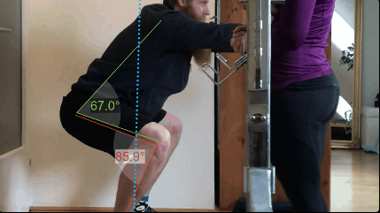
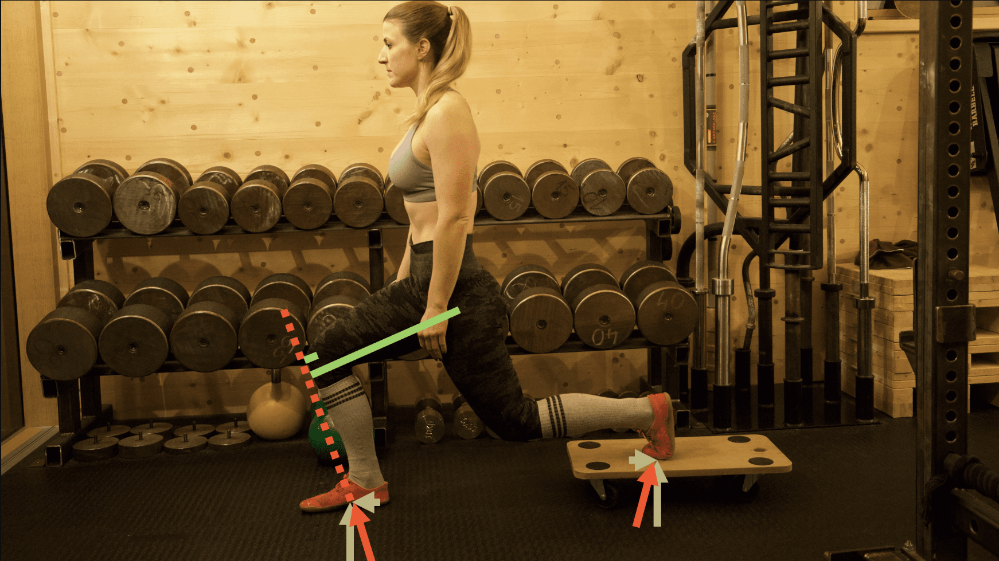
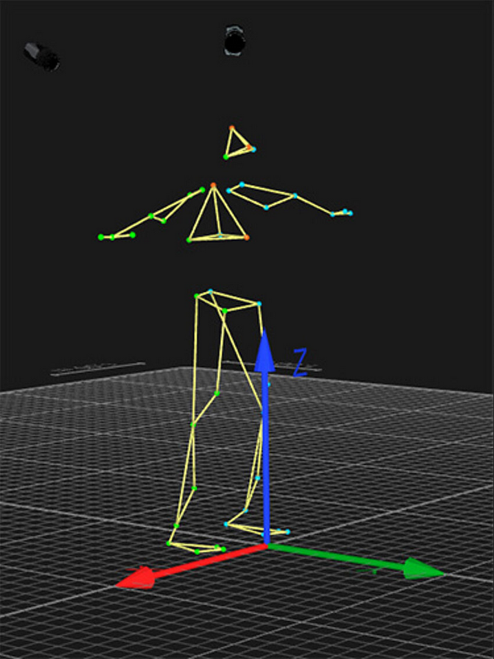

# AnimAI

AI-enabled motion recognition and animation generation.

## Goal
Use Artificial Intelligence paradigms to analyze body movement given video input.

Secondarily, generate an animated model for further use-cases.

## Use-Cases
### Sports
Analytics of technique and compensation strategies for different muscle groups given movement changes per exersice repetition.\

### Motion capture 
Use models and animations in video or game development

## Technology & Implementation
- Request for comments on technologies to use
- Too much effort for this class/for one person?

## References
- Pose detection: https://developers.google.com/ml-kit/vision/pose-detection 
- AI Pose Estimation with Python and MediaPipe | Plus AI Gym Tracker Project: https://www.youtube.com/watch?v=06TE_U21FK4
- Intelligent Strenght (Access restrictions to members): https://intelligentstrength.net/peak-category/coaches-development/ 
- MIT News - Massachusetts Institute of Technology
Artificial intelligence senses people through walls | MIT News | Massachusetts Institute of Technology: https://news.mit.edu/2018/artificial-intelligence-senses-people-through-walls-0612